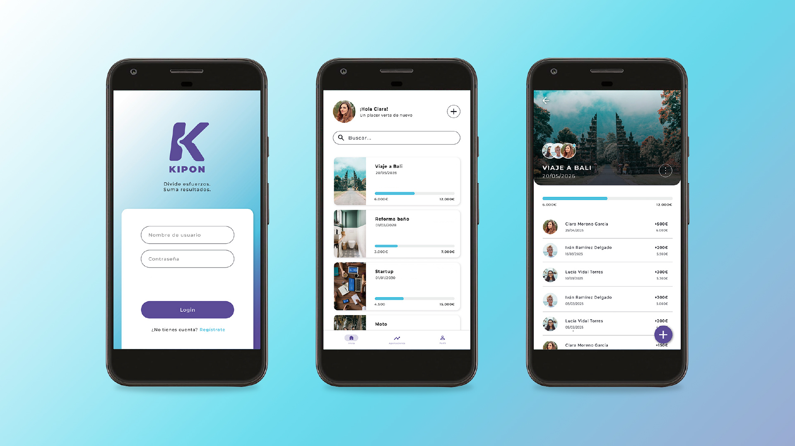

# Kipon 

**Kipon** es una aplicación Android desarrollada como proyecto final del Ciclo Formativo de Grado Superior en Desarrollo de Aplicaciones Multiplataforma (DAM). La idea surge como respuesta a una necesidad personal: ahorrar dinero de forma colaborativa entre más de dos personas, ya sea para alcanzar objetivos personales (como viajes, regalos o eventos) o profesionales (como financiar un emprendimiento o un proyecto conjunto).

Aunque existen soluciones para el ahorro individual o la gestión compartida de gastos, Kipon se centra en crear "huchas" compartidas, simplificando la organización financiera en grupo y promoviendo la transparencia.

La aplicación está desarrollanda en `Kotlin` con `Jetpack Compose`, `Material Design`, arquitectura `Clean Arquitecture`con un modelo de presentación `MVVM` y librerías compatibles con `KMP`.

## Requisitos
  

- Lenguaje: Kotlin
- Toolkit: Jetpack, Koin, Ktor.
- SKD mínimo: 28
- SDK máximo: 35

---

## Tecnologías y librerías

- **Jetpack Compose**: Toolkit moderno de Android para desarrollar interfaces declarativas de forma rápida y eficiente.
- **ViewModel**: Permite mantener y gestionar datos de UI de manera segura ante cambios de configuración.
- **[LiveData](https://developer.android.com/topic/libraries/architecture/livedata?hl=es-419#create_livedata_objects)**: Observa los datos y permite que la UI reaccione automáticamente a los cambios.
- **[Navigation Compose](https://developer.android.com/develop/ui/compose/navigation?hl=es-419)**: Navegación entre pantallas.
- **[Ktor](https://ktor.io/docs/client-create-multiplatform-application.html)**: Conexión a APIREST con soporte multiplataforma.
- **[Koin](https://insert-koin.io/docs/reference/koin-mp/kmp/)**: Inyección de dependencias con soporte multiplataforma.
- **[Kotlin serialization](https://github.com/Kotlin/kotlinx.serialization)**: Serialización sin reflexión, multiplataforma y multi-formato.
- **[Coroutines](https://kotlinlang.org/docs/coroutines-overview.html)**: Facilita la programación asíncrona y concurrente, permitiendo operaciones de red y base de datos sin bloquear el hilo principal.

---

## Arquitectura

- **Arquitectura limpia (Clean Architecture)** con modelo de presentación **MVVM (Model - ViewModel - View)**:
  Se ha estructurado el proyecto siguiendo principios de Clean Architecture para mejorar la mantenibilidad, testabilidad y escalabilidad del código. La lógica de negocio se encuentra desacoplada de la lógica de presentación, permitiendo un desarrollo modular y enfocado a responsabilidades específicas.

### Capa de datos
- **API**: Consumo de datos desde una API REST utilizando Ktor.
- **Repositorios**: Interfaz que define las operaciones de acceso a datos, implementada para interactuar con la API REST y la base de datos local.

### Capa de dominio
- **Lógica de negocio**: Implementación de los casos de uso necesarios para llevar a cabo las funcionalidades desarrolladas.

### Capa de presentación
- **ViewModels**: Clases que gestionan la lógica de presentación y exponen datos a la UI, utilizando LiveData para notificar cambios.
- **Composables**: Componentes de UI declarativos construidos con Jetpack Compose, que representan la vista y reaccionan a los cambios en los datos.
- **Screens**: Pantallas de la aplicación que utilizan los composables para mostrar la información al usuario.

---

## APIREST
Utilización de APIREST propia para el backend desarrollada en Java con Spring e integración de `servicios AWS`.
Puedes acceder al código desde el siguiente repositorio: [Kipon API](https://github.com/AnnaSolox/kipon-api)

---

## LICENSE
Diseñado y desarrollado por AnnaSolox en 2025.

Este proyecto está bajo la licencia [Apache 2.0](./LICENSE).
No puedes usar este archivo salvo en cumplimiento con la Licencia.
Puedes obtener una copia de la Licencia en:

https://opensource.org/license/apache-2-0

A menos que lo exija la ley aplicable o se acuerde por escrito, el software distribuido bajo la Licencia se distribuye "TAL CUAL", SIN GARANTÍAS NI CONDICIONES DE NINGÚN TIPO, ya sean expresas o implícitas.
Consulta la Licencia para conocer el lenguaje específico que regula los permisos y limitaciones bajo la Licencia.

